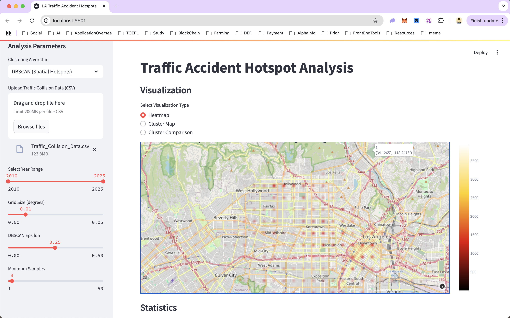
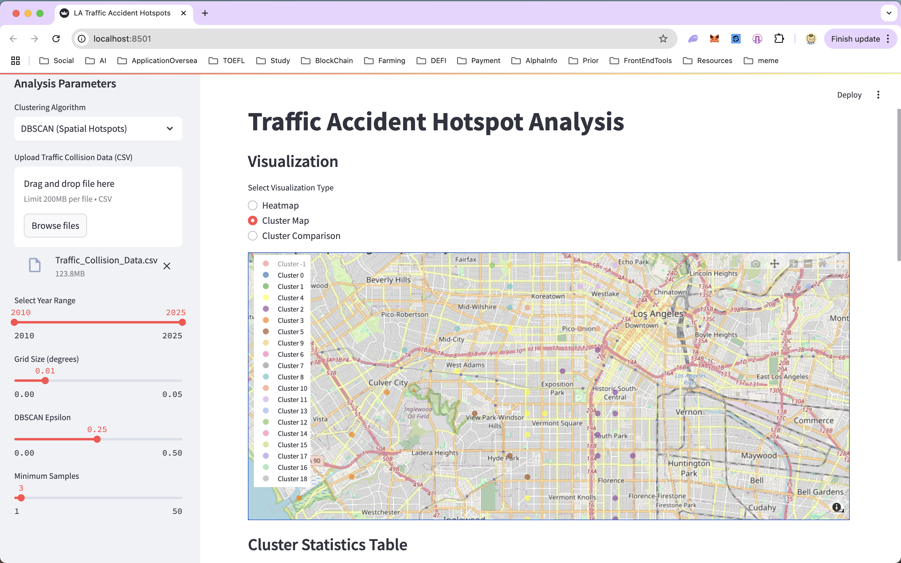
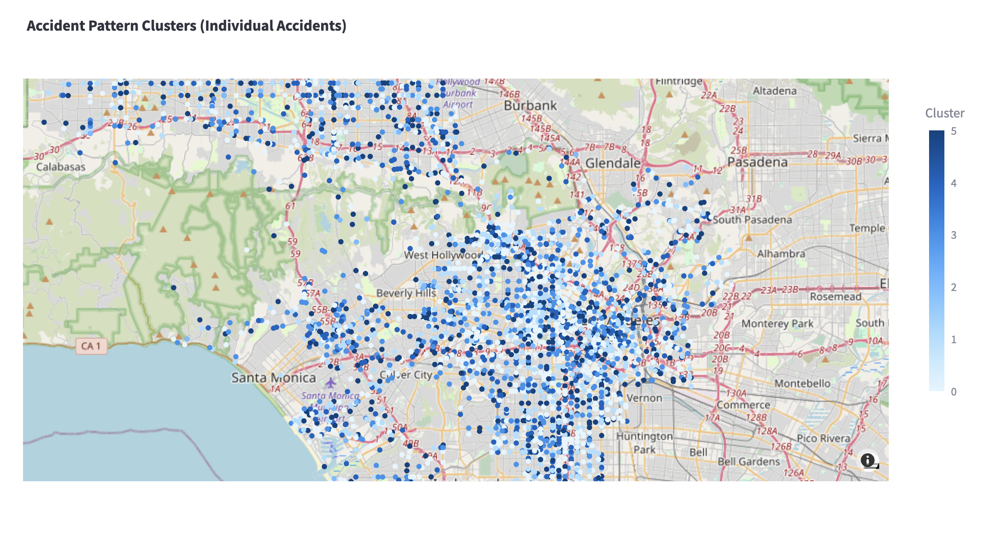
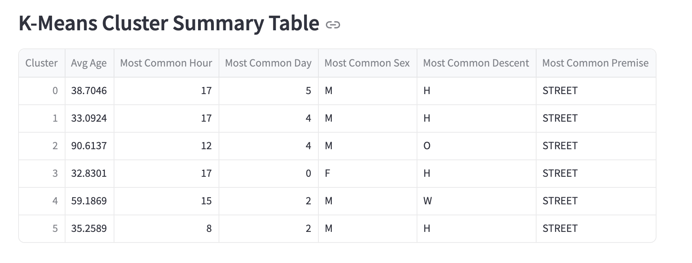

# 🚦 LA Traffic Accident Hotspot Analysis

**_This project was created as part of a data mining assignment to demonstrate practical applications of clustering and visualization on real-world datasets. The goal is to uncover patterns in Los Angeles traffic accident data and present them in an accessible, visual way._**

---

## 🎯 Main Functionalities

- **Upload your own traffic accident CSV data**
- **Automatic data cleaning and preprocessing** (date/time parsing, location extraction, etc.)
- **Feature engineering** (grid assignment, one-hot encoding, etc.)
- **Spatial clustering with DBSCAN** (find accident hotspots by location)
- **Pattern-based clustering with K-Means** (group accidents by age, time, etc.)
- **Interactive map visualizations** (heatmaps, cluster overlays)
- **Cluster summary tables** (see what makes each group unique)
- **Time series and trend analysis**
- **Parameter tuning via sidebar controls**
- **Compare clustering methods side-by-side**
- **Robust error handling and flexible summary tables**

---

## 🚀 What's Inside?

- **app.py**  
  The main Streamlit app. Upload your CSV, pick a clustering method (DBSCAN for spatial, K-Means for accident patterns), and visualize the results on a map or in summary tables.

- **traffic_hotspots/data_preparation.py**  
  Loads and cleans your data, extracts time/location features, and assigns severity levels.

- **traffic_hotspots/feature_engineering.py**  
  Turns raw data into features for clustering (like grid cells, accident counts, and one-hot encodings).

- **traffic_hotspots/clustering.py**  
  Runs DBSCAN or K-Means clustering, and summarizes what makes each cluster unique.

- **traffic_hotspots/visualization.py**  
  Makes all the pretty maps and charts (heatmaps, cluster maps, time series, etc).

---

## 🏁 How to Use

1. **Clone this repo** and install requirements (see below).
2. **Run the app:**  
   ```
   streamlit run app.py
   ```
3. **Upload your traffic collision CSV** (see sample format below).
4. **Pick a clustering method** and explore the results!

---

## 📝 Data Format

Your CSV should have at least these columns:
- `Date Occurred`, `Time Occurred`, `Location`, `Victim Age`, `Victim Sex`, `Victim Descent`, `Premise Description`

---

## 🗺️ What You'll See

- **Heatmap:** Where accidents are most dense.
- **Cluster Map:** Groups of similar accidents (by location or pattern).
- **Summary Table:** For each cluster, see average age, most common hour, day, sex, descent, and premise.
- **Compare Clustering:** See how different clustering methods group the data.

---

## 📸 Demo & Analysis

### Heatmap


The heatmap reveals that traffic accidents in Los Angeles are primarily concentrated in three regions: Hollywood, Downtown, and Koreatown.

---

### Cluster Map (DBSCAN)


**Cluster Statistics Table**

| Cluster | Accident Count | Avg Victim Age | Most Common Hour | Weekend Ratio |
|---------|---------------|---------------|------------------|---------------|
| -1      | 554501        | 42.91         | 17               | 0.28          |
| 0       | 5             | 42            | 8                | 0             |
| 1       | 3295          | 39.87         | 17               | 0.31          |
| 2       | 12453         | 38.81         | 17               | 0.32          |
| 3       | 910           | 41.20         | 18               | 0.24          |
| 4       | 11599         | 41.41         | 17               | 0.30          |
| 5       | 3114          | 42.27         | 18               | 0.29          |
| 6       | 1059          | 42.76         | 16               | 0.32          |
| 7       | 10            | 46.72         | 8                | 0             |
| 8       | 3108          | 40.78         | 18               | 0.24          |
| 9       | 3375          | 40.95         | 15               | 0.28          |
| 10      | 7445          | 40.60         | 18               | 0.30          |
| 11      | 5019          | 40.66         | 17               | 0.28          |
| 12      | 2594          | 41.75         | 17               | 0.29          |
| 13      | 3             | 46            | 6                | 0             |
| 14      | 272           | 44.95         | 8                | 0.22          |
| 15      | 2092          | 40.30         | 18               | 0.28          |
| 16      | 1177          | 42.90         | 17               | 0.23          |
| 17      | 1556          | 41.85         | 18               | 0.27          |
| 18      | 1208          | 39.33         | 18               | 0.31          |

The DBSCAN clustering results show that, in addition to noise points (Cluster -1), there are multiple valid accident hotspot clusters (Cluster 0~18). This indicates that Los Angeles has several spatially distinct accident-prone areas, rather than a uniform distribution.

- Cluster 2: The highest number of accidents (12,453), average victim age 38.8, most common accident hour is 17:00, weekend ratio 0.32. This suggests this area sees many accidents during evening rush hour, mainly involving middle-aged adults.
- Cluster 4: Also a high accident count (11,599), average age 41.4, most common hour 17:00, weekend ratio 0.30. Similar characteristics to Cluster 2.
- Clusters 1, 5, 8, etc.: Fewer accidents, possibly representing smaller local hotspots or sporadic events.

Most clusters have their "Most Common Hour" between 17:00 and 18:00, indicating the evening rush hour is the peak period for accidents. The "Avg Victim Age" is mostly around 40, showing that middle-aged individuals are the main victims. The "Weekend Ratio" is generally between 0.23 and 0.32, suggesting accidents are fairly evenly distributed between weekdays and weekends.

---

### Cluster Comparison

The Accident Count Plot shows significant differences in accident numbers across clusters. Some clusters (such as 2, 4, 10) have much higher accident counts, indicating these are key accident-prone areas that warrant special attention and management.

The Avg Severity Plot shows that the average severity in most clusters is close to 2, indicating little difference in accident types between clusters, with most being of moderate severity.

The Weekend Ratio Plot shows that some clusters have a weekend ratio as high as 0.32, indicating these areas see more accidents on weekends, possibly related to leisure, entertainment, or commercial activities. Some clusters have lower weekend ratios (e.g., 0.22, 0.23), suggesting accidents there occur mainly on weekdays, possibly in commuting or industrial areas.

---

### K-Means (Set Number of clusters to 6)



The K-Means results show the typical characteristics of each cluster (see table):
- Cluster 0: Average age 38.7, peak accident hour 17:00, most common day Friday, mostly male (M) and Hispanic (H) victims, mainly on streets.
- Cluster 1: Average age 33, peak hour 17:00, most common day Thursday, mostly male, Hispanic, on streets.
- Cluster 2: Very high average age (90), peak hour 12:00, most common day Thursday, mostly male, other descent (O), on streets—possibly a special group of elderly-related accidents.
- Cluster 3: Average age 32.8, peak hour 17:00, most common day Sunday, mostly female, Hispanic, on streets.
- Cluster 4: Average age 59.2, peak hour 15:00, most common day Wednesday, mostly male, White (W), on streets.
- Cluster 5: Average age 35.3, peak hour 8:00, most common day Wednesday, mostly male, Hispanic, on streets.

Most clusters have "Most Common Hour" at 17:00 (evening rush), but some differ (e.g., Cluster 5 at 8:00, Cluster 2 at 12:00). "Most Common Day" varies, indicating different accident patterns throughout the week. "Most Common Sex" is usually male, but some clusters are female-dominated. "Most Common Descent" shows the diversity of victims across clusters, reflecting the city's multicultural nature and different risk profiles. All clusters have "Most Common Premise" as STREET, indicating streets are the primary accident locations.

---

## 🧩 File-by-File Quick Comments

You can add these at the top of each file or above key functions for clarity:

- **app.py**
  ```python
  # Main Streamlit app for interactive accident hotspot analysis
  ```

- **data_preparation.py**
  ```python
  # Functions to load, clean, and preprocess accident data
  ```

- **feature_engineering.py**
  ```python
  # Feature engineering: grid assignment, feature matrix creation, encoding
  ```

- **clustering.py**
  ```python
  # Clustering logic: DBSCAN, K-Means, and cluster summaries
  ```

- **visualization.py**
  ```python
  # Visualization helpers: maps, charts, and summary plots
  ```

---

## 💡 Tips

- For K-Means, clusters are based on accident features (age, time, sex, etc).
- For DBSCAN, clusters are based on accident density in space.
- The summary table helps you quickly "profile" each cluster.

---

## 📦 Install Requirements

You'll need Python 3.8+ and these packages:
```
pip install streamlit pandas numpy scikit-learn plotly folium streamlit-folium geopandas shapely python-dotenv
```

---

## 🙌 Contributing

PRs and suggestions welcome! If you find a bug or want a new feature, open an issue.

---

## 📄 License

MIT License. Use, share, and remix! 